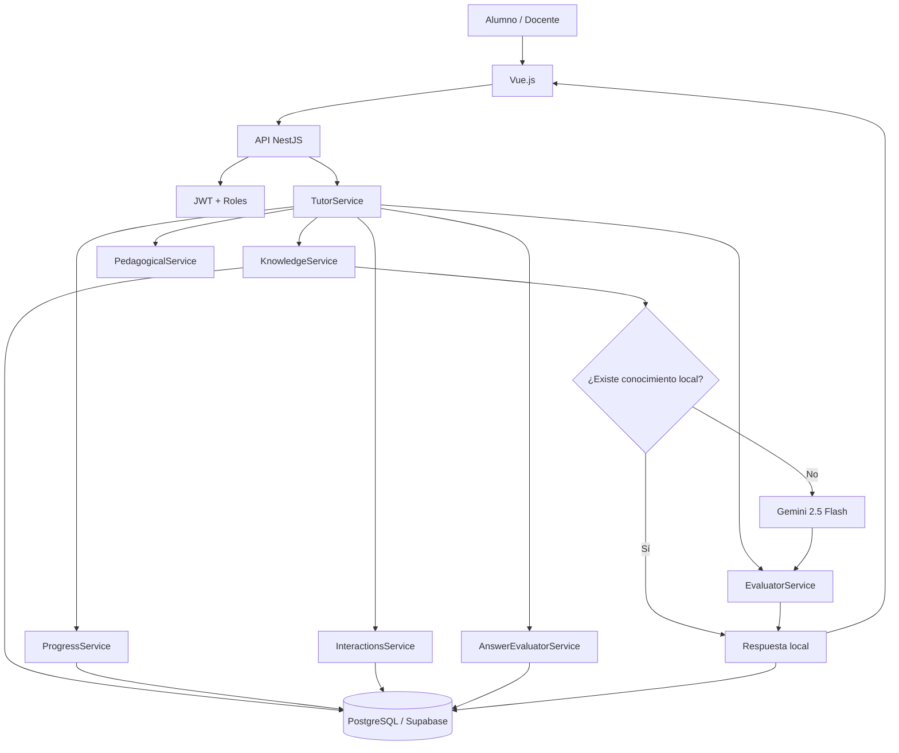

# TutorIA

**Tutor inteligente para instituciones educativas basado en Inteligencia Artificial, memoria persistente y seguimiento del aprendizaje.**

TutorIA fue desarrollado como proyecto final del curso **Inteligencia Artificial Aplicada a Organizaciones – UTN FRBA**.

🌐 **Aplicación en producción:**  
https://tutor-ia-eight.vercel.app

📦 **Repositorio:**  
https://github.com/Izxy86/TutorIA

---

## ¿Qué es TutorIA?

TutorIA es una plataforma educativa que busca complementar el trabajo del docente mediante un tutor digital capaz de acompañar al estudiante durante su proceso de aprendizaje.

A diferencia de un chatbot genérico, TutorIA trabaja dentro de un contexto educativo controlado y tiene en cuenta:

- material académico cargado por el docente;
- historial de interacciones del estudiante;
- progreso por tema;
- tipo de actividad que está realizando;
- respuestas y ejercicios anteriores;
- reglas pedagógicas específicas.

El objetivo no es reemplazar al docente, sino proporcionar una herramienta de apoyo que pueda ofrecer explicaciones, generar prácticas, evaluar respuestas y registrar la evolución del alumno.

---

## Problema que resuelve

Los asistentes de IA tradicionales pueden responder utilizando información externa al programa educativo, entregar directamente soluciones cuando el alumno debería razonar o ignorar completamente su desempeño previo.

TutorIA aborda ese problema mediante un sistema donde:

1. se consulta primero la **base de conocimiento institucional**;
2. se utiliza IA externa solamente cuando la información local no resulta suficiente;
3. las respuestas generadas pueden almacenarse para evitar consultas repetidas;
4. el comportamiento cambia según el modo pedagógico;
5. las interacciones y resultados quedan registrados;
6. el progreso del estudiante se utiliza como memoria para futuras consultas.

---

## Principio de funcionamiento

> **Información local primero. IA solamente cuando es necesaria.**

TutorIA evita consultar innecesariamente al modelo generativo.

Cuando un alumno realiza una consulta:

```text
Pregunta del estudiante
        ↓
Base de conocimiento local
        ↓
¿Existe información relevante?
     ↙           ↘
   Sí             No
   ↓               ↓
Respuesta       Memoria +
local           progreso
                   ↓
               Gemini
                   ↓
             Evaluación
                   ↓
                Respuesta
                   ↓
          Persistencia / caché
```

Esto permite reducir consumo de tokens, reutilizar conocimiento previamente generado y mantener mayor control sobre las respuestas educativas.

---

## Funcionalidades

### Alumno

El estudiante puede:

- iniciar sesión;
- seleccionar una materia;
- utilizar el modo **Aprender**;
- utilizar el modo **Practicar**;
- realizar preguntas a TutorIA;
- recibir explicaciones adaptadas;
- resolver ejercicios;
- recibir feedback sobre sus respuestas;
- volver a intentar ejercicios incorrectos;
- consultar su progreso académico.

### Docente

El docente puede:

- iniciar sesión con permisos específicos;
- acceder al dashboard de la materia;
- visualizar estudiantes;
- consultar dominio promedio;
- analizar cantidad de interacciones;
- detectar solicitudes de ayuda;
- detectar posibles intentos de evasión;
- consultar progreso por tema;
- visualizar temas que requieren refuerzo;
- administrar la base de conocimiento;
- agregar material académico;
- visualizar contenido generado por IA almacenado en la base.

---

## Modos pedagógicos

TutorIA define diferentes tipos de actividad:

```text
LEARNING
PRACTICE
HOMEWORK
EXAM
REVIEW
```

Cada modo modifica las reglas que debe seguir el tutor.

Por ejemplo, en **LEARNING** puede explicar un concepto de manera completa, mientras que en **PRACTICE** debe guiar al estudiante sin proporcionar directamente la solución del ejercicio.

---

## Orquestación

La orquestación está implementada mediante servicios propios en **NestJS**, sin utilizar frameworks externos como LangChain.

Los principales componentes son:

### TutorService

Actúa como orquestador principal.

Coordina:

- búsqueda de conocimiento;
- recuperación de memoria;
- progreso académico;
- reglas pedagógicas;
- generación mediante IA;
- evaluación de respuestas;
- persistencia de interacciones;
- actualización del progreso.

### KnowledgeService

Administra la base de conocimiento.

Distingue entre:

```text
TEACHER
AI
```

El contenido docente tiene prioridad, mientras que determinadas respuestas válidas generadas mediante IA pueden reutilizarse posteriormente.

### PedagogicalService

Define las reglas pedagógicas según el tipo de actividad.

Determina cómo debe comportarse TutorIA en situaciones de aprendizaje, práctica, tarea, examen o revisión.

### EvaluatorService

Evalúa las respuestas generadas por el tutor antes de entregarlas al estudiante.

Entre otras cosas, busca evitar que TutorIA entregue directamente soluciones cuando el modo pedagógico no lo permite.

También detecta posibles expresiones relacionadas con:

- evasión;
- pedido directo de respuestas;
- dificultad del estudiante;
- necesidad de ayuda.

### AnswerEvaluatorService

Evalúa las respuestas proporcionadas por el alumno.

La evaluación no depende solamente de una comparación literal, permitiendo reconocer respuestas conceptualmente correctas.

---

## Memoria persistente

TutorIA mantiene información entre diferentes sesiones.

Se almacenan:

- usuarios;
- materias;
- contenido académico;
- interacciones;
- preguntas;
- respuestas;
- evaluaciones;
- progreso;
- cantidad de intentos;
- respuestas correctas;
- ejercicios pendientes.

Esto permite que nuevas respuestas puedan adaptarse al historial del estudiante.

---

## Ejercicios pendientes

Cuando TutorIA genera un ejercicio en modo práctica, el backend puede almacenar internamente:

```text
question
topic
expectedAnswer
userId
subjectId
```

La respuesta correcta **no se envía al frontend**.

Cuando el alumno responde:

```text
Alumno responde
      ↓
AnswerEvaluatorService
      ↓
¿Respuesta correcta?
   ↙             ↘
 No               Sí
 ↓                 ↓
Feedback      Actualiza progreso
 ↓                 ↓
Permanece       Elimina ejercicio
pendiente         pendiente
```

Esto permite reintentar ejercicios incorrectos sin revelar la solución.

---

## Seguimiento del progreso

El progreso del estudiante se almacena por:

```text
Usuario + Materia + Tema
```

Se registran:

- nivel de dominio;
- cantidad de intentos;
- respuestas correctas;
- fecha de actualización.

Esta información posteriormente forma parte del contexto utilizado por TutorIA para adaptar sus respuestas.

---

## Arquitectura



---

## Stack tecnológico

| Componente | Tecnología |
|---|---|
| Frontend | Vue.js 3 |
| Lenguaje frontend | TypeScript |
| Estado | Pinia |
| Navegación | Vue Router |
| HTTP Client | Axios |
| Backend | Node.js + NestJS |
| Lenguaje backend | TypeScript |
| ORM | Prisma |
| Base de datos | PostgreSQL |
| Hosting BD | Supabase |
| IA | Gemini 2.5 Flash |
| Autenticación | JWT |
| Contraseñas | bcrypt |
| Frontend producción | Vercel |
| Backend producción | Render |
| Control de versiones | Git + GitHub |

---

## Estructura del proyecto

```text
TutorIA/
│
├── backend/
│   ├── prisma/
│   │   ├── migrations/
│   │   └── schema.prisma
│   │
│   └── src/
│       ├── ai/
│       ├── answer-evaluator/
│       ├── auth/
│       ├── evaluator/
│       ├── interactions/
│       ├── knowledge/
│       ├── pedagogical/
│       ├── prisma/
│       ├── progress/
│       └── tutor/
│
├── frontend/
│   └── src/
│       ├── components/
│       ├── router/
│       ├── services/
│       ├── stores/
│       └── views/
│
└── README.md
```

---

## Modelo de datos

Las principales entidades persistidas mediante Prisma son:

```text
User
Subject
KnowledgeItem
Interaction
StudentProgress
Evaluation
PendingExercise
```

### Relaciones principales

```text
User
 ├── Interaction
 ├── StudentProgress
 ├── Evaluation
 └── PendingExercise

Subject
 ├── KnowledgeItem
 ├── Interaction
 ├── StudentProgress
 └── PendingExercise

Interaction
 └── Evaluation
```

---

## Seguridad

TutorIA implementa diferentes medidas de seguridad.

### Autenticación

La aplicación utiliza **JWT** para autenticar solicitudes.

### Autorización

Los endpoints protegidos utilizan:

```text
JwtGuard
RolesGuard
```

Esto permite restringir funcionalidades según el rol.

Actualmente el MVP implementa flujos funcionales para:

```text
STUDENT
TEACHER
```

### Contraseñas

Las contraseñas se almacenan utilizando **bcrypt**, evitando persistirlas en texto plano.

### Secretos

Las credenciales y API Keys se administran mediante variables de entorno y no se almacenan directamente en el código.

---

## Instalación local

### Requisitos

```text
Node.js 22+
npm
PostgreSQL
Cuenta / API Key de Gemini
```

Clonar el repositorio:

```bash
git clone https://github.com/Izxy86/TutorIA.git
cd TutorIA
```

---

## Backend

Ingresar al backend:

```bash
cd backend
```

Instalar dependencias:

```bash
npm install
```

Crear un archivo `.env` con las variables necesarias:

```env
DATABASE_URL=
DIRECT_URL=
GEMINI_API_KEY=
JWT_SECRET=
FRONTEND_URL=http://localhost:5173
```

Generar Prisma Client:

```bash
npx prisma generate
```

Aplicar las migraciones:

```bash
npx prisma migrate dev
```

Levantar NestJS:

```bash
npm run start:dev
```

El backend queda disponible por defecto en:

```text
http://localhost:3000
```

---

## Frontend

Desde la raíz del proyecto:

```bash
cd frontend
```

Instalar dependencias:

```bash
npm install
```

Crear el archivo `.env`:

```env
VITE_API_URL=http://localhost:3000
```

Ejecutar Vue:

```bash
npm run dev
```

La aplicación estará disponible normalmente en:

```text
http://localhost:5173
```

---

## Producción

La aplicación se encuentra desplegada utilizando una arquitectura separada:

```text
Frontend
Vue + Vite
     ↓
Vercel
     ↓
NestJS API
     ↓
Render
     ↓
Prisma
     ↓
PostgreSQL / Supabase
```

### Aplicación

https://tutor-ia-eight.vercel.app

---

## Inteligencia Artificial

TutorIA utiliza actualmente:

**Google Gemini 2.5 Flash**

La IA no funciona como única fuente de información.

El orden utilizado por el sistema es:

```text
1. Conocimiento institucional
2. Respuestas de IA previamente almacenadas
3. Memoria del estudiante
4. Progreso académico
5. Gemini
6. Evaluación
7. Persistencia
```

De esta forma se busca equilibrar:

- calidad de respuesta;
- contexto académico;
- personalización;
- privacidad;
- reducción del consumo de tokens.

---

## Posibles evoluciones

TutorIA fue desarrollado como MVP y permite continuar incorporando funcionalidades como:

- modelos de IA locales mediante Ollama;
- nuevos roles institucionales;
- más materias y cursos;
- analíticas históricas;
- generación de evaluaciones;
- mayor personalización por nivel de dominio;
- validación docente de contenido generado;
- notificaciones y alertas tempranas;
- métricas longitudinales de aprendizaje.

---

## Estado del proyecto

**MVP funcional y desplegado.**

Actualmente se encuentran implementados y probados:

```text
✓ Autenticación
✓ Roles Alumno / Docente
✓ Base de conocimiento
✓ Integración con Gemini
✓ Memoria persistente
✓ Modos pedagógicos
✓ Generación de ejercicios
✓ Evaluación de respuestas
✓ Seguimiento de progreso
✓ Dashboard docente
✓ Gestión de material
✓ Caché de respuestas IA
✓ Despliegue frontend
✓ Despliegue backend
✓ Base de datos en producción
```

---

## Autor

**Martín Gamboggi**

Desarrollo Full Stack y diseño de la solución basada en Inteligencia Artificial.

Proyecto desarrollado para:

**Universidad Tecnológica Nacional – Facultad Regional Buenos Aires**  
**Inteligencia Artificial Aplicada a Organizaciones**  
**Trabajo Final – 2026**